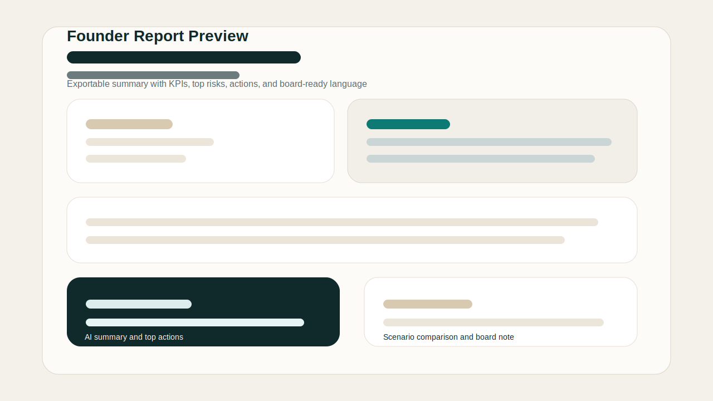

# RunwayPilot

**One-line pitch:** An AI finance copilot for startups and small businesses that predicts runway, detects risky spending patterns, and recommends actions before cash problems become existential.


## Why this matters

Founders usually discover cash problems too late. Burn expands silently through payroll drift, infrastructure spikes, duplicated tools, or slowing collections while the team is still reading stale spreadsheets. RunwayPilot turns uploaded transactions into a live operating picture: current runway, cashflow deterioration, anomaly detection, scenario planning, and a founder-ready explanation layer powered by NVIDIA NIM.

## Feature list

- Cashflow dashboard with cash balance, burn, runway, revenue trend, expense trend, and top categories
- Spend intelligence for categorization, anomalies, duplicate subscriptions, recurring waste, and vendor concentration
- Forecasting engine with baseline, optimistic, and conservative runway views
- Scenario simulator for revenue, payroll, software, infrastructure, one-time costs, and growth mode
- AI CFO copilot that explains what changed, what matters, and what actions to take next
- Founder or investor-ready exportable report
- Demo mode with realistic seeded startup finance data plus CSV upload support

## Setup instructions

```bash
npm install
npm run dev
```

Open `http://localhost:3000` and either load the bundled demo dataset or upload a CSV with these columns:

- `date`
- `description`
- `vendor`
- `amount`
- `direction` (optional)
- `category_hint` (optional)
- `notes` (optional)

## Deployment instructions

1. Push the repository to a public GitHub repo.
2. Import the repo into Vercel.
3. Add `NVIDIA_NIM_API_KEY` in the Vercel project settings.
4. Optionally set `NVIDIA_NIM_MODEL` if you want to override the fast default model.
5. Redeploy.

The repo already includes `vercel.json`, a Next.js App Router setup, and a GitHub Actions workflow for build verification.

## NVIDIA NIM setup

Add this environment variable:

```bash
NVIDIA_NIM_API_KEY=
```

Optional:

```bash
NVIDIA_NIM_MODEL=nvidia/llama-3.1-nemotron-nano-8b-v1
```

RunwayPilot uses NVIDIA NIM for:

- business-language financial explanations
- structured recommendations
- scenario interpretation
- anomaly explanation
- founder-facing board notes

If the key is missing, the Strategy Agent falls back to deterministic, rules-based guidance so judges can still test the full product flow.

## Judge runbook

Use this deterministic 60-second demo path:

1. Open the live app and click `Load sample startup data`.
2. Read the KPI strip: cash balance, burn, runway, revenue trend, expense trend.
3. Point to the anomaly and duplicated charge in the risk panel.
4. Show the downside simulator by dropping revenue and adding a one-time cost.
5. Open the AI CFO panel and show the NVIDIA NIM explanation plus top 3 actions.
6. Export the founder report to show board-ready output.

## Architecture overview

RunwayPilot is built as a lightweight Next.js application with a deterministic finance pipeline and a narrow AI layer:

- `Intake Agent`: validates and standardizes CSV or demo data
- `Classification Agent`: categorizes transactions and recurring spend
- `Forecast Agent`: computes burn, runway, and 6-month scenario projections
- `Risk Agent`: finds anomalies, concentration, duplicated spend, and deterioration patterns
- `Strategy Agent`: calls NVIDIA NIM for structured, founder-readable guidance

The product is intentionally backend-light for hackathon speed and demo reliability.

## Screenshots

- Dashboard concept preview:

  

- Founder report preview:

  

## Why this fits the Orion Build Challenge

- **Innovation:** blends deterministic financial intelligence with explainable AI recommendations instead of a generic chatbot wrapper
- **Presentation:** premium fintech UX, clear KPI hierarchy, scenario storytelling, and demo-friendly seeded data
- **Functionality:** full MVP flow from ingestion to forecasting, risk detection, AI insights, and report export
- **Problem solving:** addresses a real operating pain point shared by founders, SMBs, and accelerator portfolios

It also fits multiple Orion tracks at once: fintech, enterprise SaaS, analytics, AI, and decision-support tooling.

## Future roadmap

- bank, ERP, and accounting integrations
- saved workspaces with Supabase
- benchmark comparisons across peer startups
- board packet generation and investor update workflows
- approval loops for finance leads and operators
- portfolio-level monitoring for accelerators and incubators
